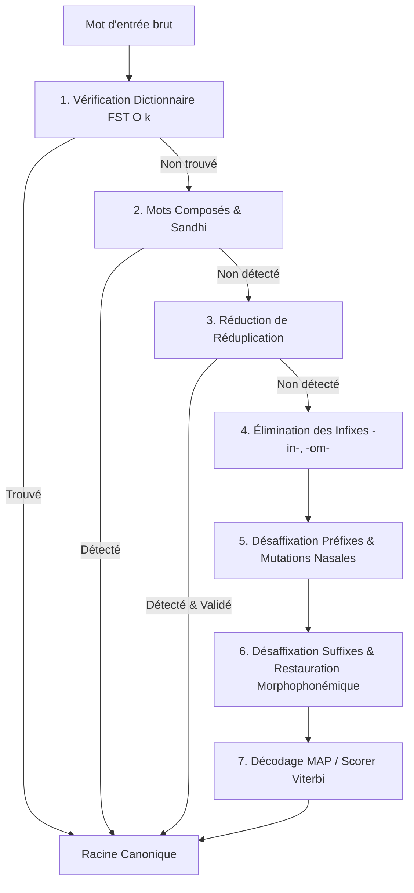

# Architecture & Performance

`malagasy-stemmer` a été conçu dès le premier jour avec une exigence de **performance temps réel** et de **compacité mémoire**.

---

## Pipeline d'Analyse Morphologique

L'architecture du moteur repose sur un graphe d'analyse à plusieurs étages :

---

## 1. Le Transducteur à États Finis (FST)

Plutôt que d'utiliser des tables de hachage traditionnelles (`HashSet`) qui consomment des mégaoctets et créent de la fragmentation mémoire, le dictionnaire de racines est compilé au moment du build (`build.rs`) en un **Transducteur à États Finis acyclique déterministe (FST)** via la bibliothèque Rust `fst`.

### Propriétés du FST :

- **Compression par partage de préfixes et de suffixes** : Plus de 10 000 racines malgaches sont compressées en seulement **~54 Ko**.
- **Lookup en $O(k)$** : Le temps de vérification ne dépend que du nombre de lettres $k$ du mot (typiquement 4 à 8 comparaisons d'octets), indépendant du volume du dictionnaire.
- **Zéro allocation mémoire** : Le graphe d'octets est embarqué directement dans le segment de données statique du binaire (`include_bytes!`).

---

## 2. Décodage MAP & Scorer Probabiliste

Lorsqu'un mot fléchi est analysé, le moteur génère plusieurs hypothèses morphologiques concurrentes.

Le module [`ViterbiScorer`](https://github.com/Tanguy1902/malagasy-stemmer/blob/main/crates/malagasy-stemmer/src/disambiguation/scorer.rs) applique une fonction d'évaluation probabiliste (_Maximum A Posteriori_) :

$$\text{Score}(c) = 0.45 \cdot P(\text{Dict}) + 0.25 \cdot P(\text{Op}) + 0.15 \cdot P(\text{Len}) + 0.15 \cdot P(\text{Phonotaxie})$$

Où :

- $P(\text{Dict})$ : Prior fort si la racine candidate existe dans le dictionnaire compilé.
- $P(\text{Op})$ : Poids intrinsèque de la règle de dérivation appliquée.
- $P(\text{Len})$ : Pénalité sur les racines dégénérées trop courtes ($\le 2$ lettres).
- $P(\text{Phonotaxie})$ : Conformité avec les règles de terminaisons syllabiques de la langue malgache (`-a`, `-y`, `-tra`, `-ka`, `-na`, `-ra`).

---

## Métriques & Benchmarks

Tests réalisés sur CPU x86_64 monocœur :

| Opération                         | Débit / Vitesse        | Mémoire                    |
| :-------------------------------- | :--------------------- | :------------------------- |
| **Stemming d'un mot**             | ~650 ns                | 0 allocation dynamique     |
| **Vérification dictionnaire FST** | < 15 ns                | 0 allocation               |
| **Traitement par lot (Batch)**    | > 1 600 000 mots / sec | Faible mémoire cache L1/L2 |
| **Taille du binaire FST**         | -                      | **53 944 octets**          |
